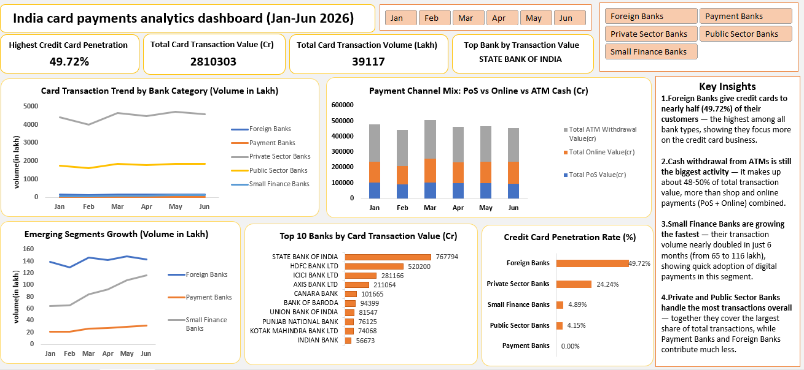

# India Card Payments Analytics Dashboard

An advanced Excel dashboard analyzing India's credit and debit card payment ecosystem — built entirely using Power Query, Power Pivot, and DAX on real government data.


## Table of Contents

- [Overview](#overview)
- [Data Source](#data-source)
- [Tools Used](#tools-used)
- [Project Workflow](#project-workflow)
- [Key Insights](#key-insights)
- [Dashboard Preview](#dashboard-preview)
- [Repository Structure](#repository-structure)
- [Author](#author)

## Overview

This project analyzes 6 months (January–June 2026) of bank-wise card and payment infrastructure data published by the Reserve Bank of India (RBI). It covers 70+ banks across 5 categories (Public Sector, Private Sector, Foreign, Payment, and Small Finance Banks), tracking credit/debit card issuance, transaction volumes, and transaction values across PoS, online, and ATM channels.

The goal was to build a portfolio-quality, end-to-end Excel analytics project — from raw, messy government data to a fully interactive dashboard — without using Python or SQL, to demonstrate advanced Excel capability for data analyst roles.

## Data Source

**Bankwise ATM/POS/Card Statistics**, Reserve Bank of India
https://www.rbi.org.in/Scripts/ATMView.aspx

6 monthly files (Jan–Jun 2026), each containing bank-wise infrastructure (ATMs, PoS terminals, QR codes) and card transaction data (volume and value across PoS, online, and ATM cash withdrawal channels, split by credit and debit cards).

## Tools Used

| Tool | Purpose |
|---|---|
| Power Query | Data cleaning and transformation |
| Power Pivot / Data Model | Relational data modeling |
| DAX | 15+ calculated measures |
| PivotTables & PivotCharts | Category-level and bank-level analysis |
| Slicers | Interactive filtering by Bank Category and Month |

## Project Workflow

1. **Data Cleaning (Power Query)** — Removed multi-row government-report headers, renamed 28 columns, extracted bank category labels using a fill-down technique, filtered out subtotal/footer rows, and fixed data types.
2. **Data Modeling** — Appended all 6 monthly tables into a single fact table (~380 rows) and loaded it into the Data Model.
3. **DAX Measures** — Built core aggregation measures (Total Credit/Debit/Card Transaction Value & Volume), Crore-converted versions for readability, Credit Card Penetration Rate, and combined Channel Mix values (PoS/Online/ATM Withdrawal).
4. **Analysis** — Built both category-level (5 bank types) and bank-level ("company-level," 70+ individual banks) views to mirror how a business analyst would compare peer groups and individual players.
5. **Dashboard** — Assembled 5 charts, 4 KPI cards, and 2 connected slicers into a single interactive dashboard sheet.

## Key Insights

1. **Foreign Banks lead in credit card penetration (49.72%)** — nearly half of their outstanding cards are credit cards, far ahead of Private Sector Banks (24.24%) and Public Sector Banks (4.15%), reflecting a premium/affluent-customer-focused business model.
2. **Payment Banks show 0% credit card penetration** — RBI regulations don't permit Payment Banks (e.g. Paytm Payments Bank, Airtel Payments Bank) to issue credit cards; they can only offer savings and payment services.
3. **Cash still dominates transaction value** — ATM cash withdrawal accounts for ~48–50% of total transaction value, more than PoS and online purchases combined, though online's share is gradually rising (28% → 31%, Jan–Jun).
4. **Small Finance Banks are the fastest-growing segment** — transaction volume nearly doubled in 6 months (~65 to ~116 lakh transactions), signaling rapid digital payment adoption among smaller banks.
5. **Market concentration is high** — the top 3 banks by transaction value (SBI, HDFC Bank, ICICI Bank) account for a disproportionately large share of total card transaction value compared to the rest of the top 10.

## Dashboard Preview



## Repository Structure

```
├── RBI_Card_Payments_Dashboard.xlsx   
├── dashboard_screenshot.png         
└── README.md                         
```

## Author

Jeba Perveen
